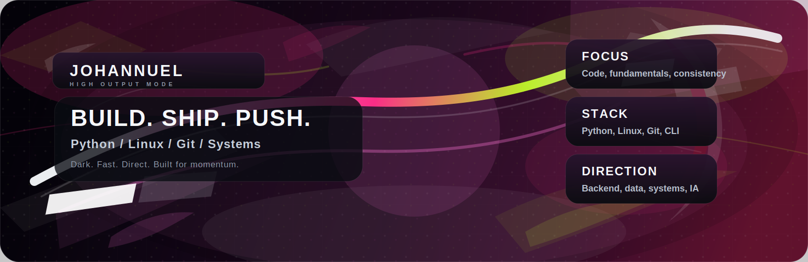
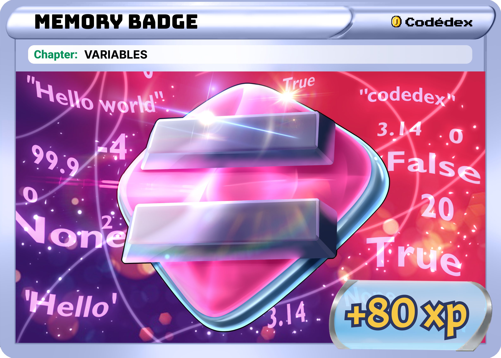

  

 

# Johannuel

**Python. Linux. Output.**

Construyo con disciplina, ejecuto con enfoque y convierto ideas simples en software util.

 

  Magenta dark build log for systems, tools, and deliberate progress.

 

## Snapshot

<table>
  <tr>
    <td>
      <strong>Focus</strong> 
      Python, consola, automatizacion, sistemas
    </td>
    <td>
      <strong>Mode</strong> 
      Aprender haciendo, depurar, repetir
    </td>
    <td>
      <strong>Direction</strong> 
      Backend, datos, redes, seguridad
    </td>
  </tr>
</table>

## Icon Set

<table>
  <tr>
    <td align="center" width="14%">
      
       <strong>Python</strong>
    </td>
    <td align="center" width="14%">
      
       <strong>Debian</strong>
    </td>
    <td align="center" width="14%">
      
       <strong>NixOS</strong>
    </td>
    <td align="center" width="14%">
      
       <strong>Linux</strong>
    </td>
  </tr>
  <tr>
    <td align="center" width="14%">
      
       <strong>VS Code</strong>
    </td>
    <td align="center" width="14%">
      
       <strong>Obsidian</strong>
    </td>
    <td align="center" width="14%">
      
       <strong>Zed</strong>
    </td>
    <td align="center" width="14%">
      
       <strong>Godot</strong>
    </td>
  </tr>
</table>

## Memory Module

<table>
  <tr>
    <td width="60%">
      
    </td>
    <td width="40%" valign="top">
      <strong>Memory Badge</strong> 
      Variables // State
        
      

        Una pieza visual para representar el arranque mental de cualquier sistema.
      

      

        Encaja con el mismo lenguaje del perfil: claridad, progreso y control.
      

    </td>
  </tr>
</table>

## Projects

<table>
  <tr>
    <td width="50%">
      <strong>Console tools</strong> 
      Calculadoras, cajeros y utilidades para entrenar logica.
    </td>
    <td width="50%">
      <strong>Learning scripts</strong> 
      Codigo para depurar, probar ideas y reforzar fundamentos.
    </td>
  </tr>
  <tr>
    <td width="50%">
      <strong>Systems practice</strong> 
      Linux, Git, archivos, automatizacion y mentalidad de sistema.
    </td>
    <td width="50%">
      <strong>Future builds</strong> 
      Backend, datos, redes y seguridad cuando la base este lista.
    </td>
  </tr>
</table>

## About

- Base tecnica solida antes que frameworks.
- Python y terminal como herramientas de trabajo.
- Entender Linux, Git y sistemas por dentro.
- Codigo claro, util y mantenible.

## Skills

<table>
  <tr>
    <td><strong>Languages</strong> Python</td>
    <td><strong>System</strong> Linux</td>
    <td><strong>Version control</strong> Git / GitHub</td>
  </tr>
  <tr>
    <td><strong>Style</strong> Console-first, minimal, direct</td>
    <td><strong>Strengths</strong> Logic, debugging, structure</td>
    <td><strong>Interests</strong> Backend, data, systems</td>
  </tr>
</table>

## What I am building now

- Stronger Python habits.
- Better code organization.
- Faster terminal workflow.
- Sharper systems understanding.

## Principles

- Primero los fundamentos.
- Menos ruido. Mas precision.
- Probar, corregir, repetir.
- Documentar tambien construye.

## Contact

<table>
  <tr>
    <td align="center" width="33%">
      
       
      <strong>GitHub</strong> 
      @Johannuel
    </td>
    <td align="center" width="33%">
      
       
      <strong>Discord</strong> 
      mfv_code
    </td>
    <td align="center" width="33%">
      
       
      <strong>Hashnode</strong> 
      @mf-coder
    </td>
  </tr>
</table>

  Open source, systems, and deliberate progress.

