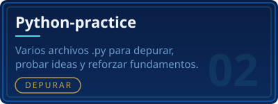

  
   
  

 

# MF coder

Linux enthusiast, becoming a DevOps engineer.

I like Rust 🦀 and Python 🐍 (I use Omarchy btw)

 

## Snapshot

<table>
  <tr>
    <td>
      <strong style="color:#51EEFC;">Focus</strong> 
      Rust, Linux, automatizacion, sistemas
    </td>
    <td>
      <strong style="color:#51EEFC;">Mode</strong> 
      Construir, depurar, repetir
    </td>
    <td>
      <strong style="color:#51EEFC;">Direction</strong> 
      DevOps: contenedores, CI/CD, infraestructura
    </td>
  </tr>
</table>

## Stack

<table>
  <tr>
    <td align="center" width="25%">
      
       <strong>Rust</strong>
    </td>
    <td align="center" width="25%">
      
       <strong>Python</strong>
    </td>
    <td align="center" width="25%">
      
       <strong>Arch</strong>
    </td>
    <td align="center" width="25%">
      
       <strong>Linux</strong>
    </td>
  </tr>
  <tr>
    <td align="center" width="25%">
      
       <strong>Hyprland</strong>
    </td>
    <td align="center" width="25%">
      
       <strong>Git</strong>
    </td>
    <td align="center" width="25%">
      
       <strong>Docker</strong>
    </td>
    <td align="center" width="25%">
      
       <strong>Neovim</strong>
    </td>
  </tr>
  <tr>
    <td align="center" width="25%">
      
       <strong>Zed</strong>
    </td>
    <td align="center" width="25%">
      
       <strong>Godot</strong>
    </td>
    <td align="center" width="25%">
      
       <strong>Obsidian</strong>
    </td>
    <td align="center" width="25%">
      
       <strong>Opencode</strong>
    </td>
  </tr>
</table>

## Now

- **Juego TUI en Rust** inspirado en Persona 3 Portable (combate por turnos, crossterm).
- **Sistema**: Arch + Hyprland + omarchy, afinado a mi flujo.
- **Curso rustlings**: fundamentos de Rust, ejercicio a ejercicio.
- **Fundamentos de DevOps**: Docker, CI/CD, automatizacion, infraestructura.

## Projects

<table>
  <tr>
    <td width="100%" align="center">
      
    </td>
  </tr>
</table>

## About

- Base tecnica solida antes que frameworks.
- Rust y la terminal como herramientas de trabajo.
- Entender Linux, Git y sistemas por dentro.
- Objetivo: construir y operar infraestructura como DevOps.

## Skills

<table>
  <tr>
    <td><strong style="color:#51EEFC;">Languages</strong> Rust, Python</td>
    <td><strong style="color:#51EEFC;">System</strong> Linux, Arch, Hyprland</td>
    <td><strong style="color:#51EEFC;">Version control</strong> Git / GitHub</td>
  </tr>
  <tr>
    <td><strong style="color:#51EEFC;">Style</strong> Console-first, minimal, direct</td>
    <td><strong style="color:#51EEFC;">Strengths</strong> Logic, debugging, structure</td>
    <td><strong style="color:#51EEFC;">Interests</strong> DevOps, data, systems</td>
  </tr>
</table>

## Principles

- Primero los fundamentos.
- Menos ruido. Mas precision.
- Probar, corregir, repetir.
- Documentar tambien construye.

## Find me

<table>
  <tr>
    <td align="center" width="20%" style="background:#0B2A5B;border:1px solid #1269CC;border-radius:14px;padding:14px;">
      
       
      <strong style="color:#F0F6FC;">GitHub</strong> 
      @Johannuel
    </td>
    <td align="center" width="20%" style="background:#0B2A5B;border:1px solid #1269CC;border-radius:14px;padding:14px;">
      
       
      <strong style="color:#F0F6FC;">X</strong> 
      @MF_coder
    </td>
    <td align="center" width="20%" style="background:#0B2A5B;border:1px solid #1269CC;border-radius:14px;padding:14px;">
      
       
      <strong style="color:#F0F6FC;">Discord</strong> 
      mfv_code
    </td>
    <td align="center" width="20%" style="background:#0B2A5B;border:1px solid #1269CC;border-radius:14px;padding:14px;">
      
       
      <strong style="color:#F0F6FC;">Hashnode</strong> 
      @mf-coder
    </td>
    <td align="center" width="20%" style="background:#0B2A5B;border:1px solid #1269CC;border-radius:14px;padding:14px;">
      
       
      <strong style="color:#F0F6FC;">Instagram</strong> 
      @chrollo_jv_
    </td>
  </tr>
</table>

  Open source, systems, and deliberate progress.

